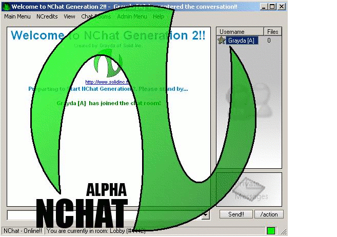



## \[ A\+\+ FEATURE PACKED\! PROFESSIONAL CODE\! HOTTEST CHAT ON THE NET\. NOT A HOW\-TO\! \]

### Description

NCHAT FORUMS ON-LINE! www.solidinc.tk

PLEASE COMMENT AND VOTE! THE Hottest chat program on the internet. When used on a network, requires NO server!! Internet ready, > 60 emoticons, private messaging with whiteboard, create your own room, earn points for chatting, hyperlink support, emotions support, full set of administrator tools (more than 20 of them), full data logging. Perfect for office, home, or other small network. More than 1 1/2 years of code here. > 5,000 lines of code, 22 FORMS, 10 MODULES, 2 CUSTOM CONTROLS. A MUST DOWNLOAD! TOO MANY FEATURES TO LIST HERE. COMMENT, CRITICISE, VOTE <-- MOST IMPORTANT
 
### More Info
 

             |
---                |---
**Submitted On**   |2004-12-22 23:18:16
**By**             |[Grayda](https://github.com/Planet-Source-Code/PSCIndex/blob/master/ByAuthor/grayda.md)
**Level**          |Advanced
**User Rating**    |4.7 (71 globes from 15 users)
**Compatibility**  |VB 5\.0, VB 6\.0
**Category**       |[Complete Applications](https://github.com/Planet-Source-Code/PSCIndex/blob/master/ByCategory/complete-applications__1-27.md)
**World**          |[Visual Basic](https://github.com/Planet-Source-Code/PSCIndex/blob/master/ByWorld/visual-basic.md)
**Archive File**   |[\[\_A\+\+\_FEAT18322312222004\.zip](https://github.com/Planet-Source-Code/grayda-a-feature-packed-professional-code-hottest-chat-on-the-net-not-a-how-to__1-57850/archive/master.zip)

